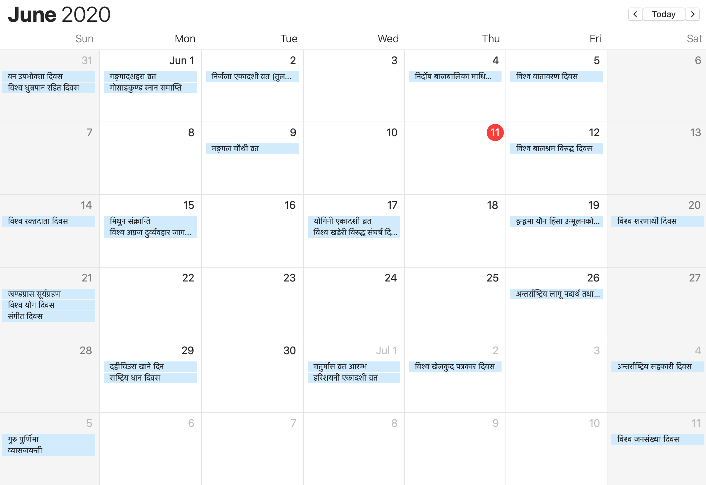
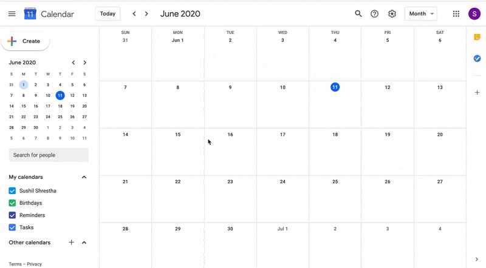
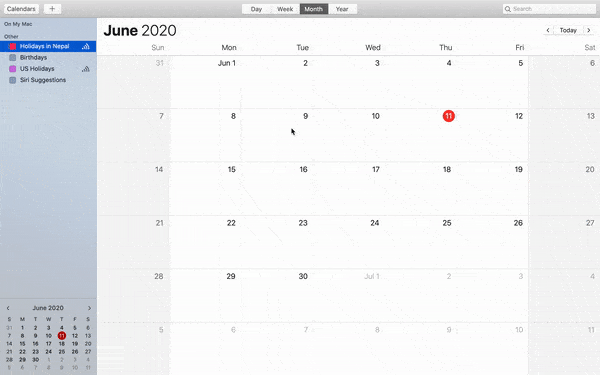

# Nepali Calendar for Google Calendar
> List of nepali events for Calendar apps

[![HitCount][hits-image]][hits-url]
[![nepal][made-in-Nepal]][repo-url]
[![nepalihoni][Nepali-ho-ni]][repo-url]

This project aims to maintain a calendar events of Nepal that can be imported to popular calendar apps such as Google Calendar and Calendar app on Mac.
The Events provided through this api is based on data from [HamroPatro](https://www.hamropatro.com/)

## Installation

###### Google Calendar

###### Calendar app on macOS

[Detail](http://shresthasushil.com.np/NepaliEvents/)

## Meta

Distributed under the MIT license. See ``LICENSE`` for more information.

## Contributing
It might be possible that calendar events go missing due to change in content pattern or failure to update the repo. Please feel free to [drop the issue](https://github.com/SushilShrestha/NepaliEvents/issues) or [send a pull request](https://github.com/SushilShrestha/NepaliEvents/pulls)

<!-- Markdown link & img dfn's -->

[repo-url]: https://github.com/SushilShrestha/NepaliEvents
[hits-image]: http://hits.dwyl.com/SushilShrestha/NepaliEvents.svg
[hits-url]: http://hits.dwyl.com/SushilShrestha/NepaliEvents
[made-in-nepal]: https://img.shields.io/badge/Made%20in-Nepal🇳🇵-green
[Nepali-ho-ni]: https://img.shields.io/badge/%20Nepali%20ho%20ni-garcha-green
